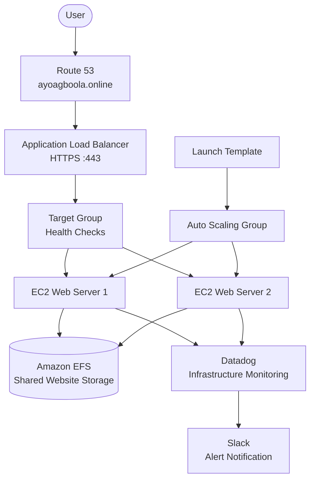
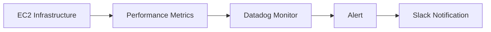

# High Availability AWS Infrastructure Project

### Building a scalable, highly available web infrastructure on AWS with monitoring and alerting

**Author:** Ayomide Emmanuel Agboola
**Role:** Data Analyst | Analytics Trainer | Cloud & DevOps Learner
**Location:** Nigeria

[](https://github.com/)
[](https://aws.amazon.com/)
[](https://www.datadoghq.com/)

---

## Table of Contents

* [Project Overview](#project-overview)
* [About the Author](#about-the-author)
* [Why I Built This Project](#why-i-built-this-project)
* [Project Objectives](#project-objectives)
* [Architecture](#architecture)
* [Project Flow](#project-flow)
* [AWS Services and Tools Used](#aws-services-and-tools-used)
* [Infrastructure Implementation](#infrastructure-implementation)

  * [1. Virtual Private Cloud](#1-virtual-private-cloud)
  * [2. Shared Storage with Amazon EFS](#2-shared-storage-with-amazon-efs)
  * [3. EC2 and Jump Server](#3-ec2-and-jump-server)
  * [4. Launch Template and Auto Scaling](#4-launch-template-and-auto-scaling)
  * [5. Application Load Balancer](#5-application-load-balancer)
  * [6. Route 53 and Custom Domain](#6-route-53-and-custom-domain)
  * [7. HTTPS with AWS Certificate Manager](#7-https-with-aws-certificate-manager)
  * [8. Monitoring and Alerting](#8-monitoring-and-alerting)
* [Security and High Availability](#security-and-high-availability)
* [Challenges and Troubleshooting](#challenges-and-troubleshooting)
* [Data Analytics Connection](#data-analytics-connection)
* [Bash Scripts](#bash-scripts)
* [Project Screenshots](#project-screenshots)
* [Live Website](#live-website)
* [Project Outcome](#project-outcome)
* [Lessons Learned](#lessons-learned)
* [Future Improvements](#future-improvements)
* [Repository Structure](#repository-structure)

---

## Project Overview

This project demonstrates the design and deployment of a highly available web infrastructure on Amazon Web Services (AWS).

The infrastructure was designed so that the website would not depend on a single server. Instead, traffic is distributed across multiple EC2 instances, while Amazon EFS provides shared storage for the website files.

An Application Load Balancer provides the entry point for users, Route 53 manages the custom domain, AWS Certificate Manager provides HTTPS encryption, and Datadog monitors the infrastructure and sends alerts to Slack.

The project brought together networking, compute, storage, scalability, security, DNS, monitoring and alerting into one working cloud environment.

---

## About the Author

I am **Ayomide Agboola**, a Data Analyst and Analytics Trainer with an interest in understanding how technology supports data-driven decision making.

My background is primarily in data analytics, but I have been expanding my technical knowledge into cloud technologies and DevOps.

This project was part of that learning journey.

Rather than only learning AWS services individually, I wanted to understand how the infrastructure underneath a data-driven application is designed, scaled, monitored and secured.

**Connect with me on LinkedIn:**
[LinkedIn](https://www.linkedin.com/in/ayomide-e-agboola)

---

## Why I Built This Project

My interest in this project goes beyond learning AWS services individually.

As a data analytics practitioner, I understand that data-driven applications need infrastructure that can handle changes in workload and remain available as demand increases.

A data pipeline or analytics application may start with a small workload, but as the amount of data and number of users increase, the infrastructure supporting it also needs to scale.

I therefore wanted to understand what happens underneath a data-driven application.

How does the infrastructure handle traffic?

How can additional servers be introduced when demand increases?

How can multiple servers work with the same files?

How can infrastructure performance be monitored?

And how can operational data be turned into alerts when something goes wrong?

This project gave me an opportunity to explore those questions by building the infrastructure rather than only studying the concepts.

---

## Project Objectives

The main objectives were to:

1. Build a secure AWS network environment.
2. Deploy application servers across multiple Availability Zones.
3. Provide shared storage using Amazon EFS.
4. Automate EC2 instance configuration using a Launch Template.
5. Configure an Auto Scaling Group for scalability and resilience.
6. Distribute application traffic using an Application Load Balancer.
7. Connect a custom domain using Amazon Route 53.
8. Secure the website using HTTPS and AWS Certificate Manager.
9. Monitor infrastructure performance using Datadog.
10. Send infrastructure alerts to Slack.
11. Understand how cloud infrastructure can support scalable data-driven workloads.

---

# Architecture

The architecture represents the complete journey from a user's request to the application servers and the monitoring system.



### How to read the architecture

The user first reaches the application through the custom domain managed by Route 53.

Route 53 directs the request to the Application Load Balancer.

The load balancer checks the target group and distributes traffic to healthy EC2 web servers.

The Auto Scaling Group manages the application instances using the Launch Template.

The EC2 instances use Amazon EFS as shared storage, meaning the application servers can access the same website files.

Datadog monitors the EC2 infrastructure and sends alerts to Slack when the configured monitoring conditions are triggered.


# Project Flow

The project was built progressively, with each stage providing a foundation for the next.


This flow represents how the project developed from the network foundation through to monitoring and alerting.

---

# AWS Services and Tools Used

| Category       | Technology                | Purpose                           |
| -------------- | ------------------------- | --------------------------------- |
| Cloud Platform | AWS                       | Cloud infrastructure              |
| Networking     | Amazon VPC                | Isolated network environment      |
| Networking     | Subnets                   | Network segmentation              |
| Networking     | Route Tables              | Traffic routing                   |
| Networking     | Internet Gateway          | Internet access                   |
| Networking     | NAT Gateway               | Outbound internet access          |
| Security       | Security Groups           | Traffic control                   |
| Compute        | Amazon EC2                | Application servers               |
| Compute        | Launch Template           | Standardised EC2 configuration    |
| Scalability    | Auto Scaling Group        | Instance management               |
| Storage        | Amazon EFS                | Shared application storage        |
| Load Balancing | Application Load Balancer | Traffic distribution              |
| DNS            | Amazon Route 53           | Domain management                 |
| Security       | AWS Certificate Manager   | SSL/TLS certificate               |
| Monitoring     | Datadog                   | Infrastructure monitoring         |
| Alerting       | Slack                     | Alert notifications               |
| Web Server     | Nginx                     | Web hosting                       |
| Automation     | Bash                      | Server configuration              |
| Documentation  | GitHub                    | Documentation and version control |


# Infrastructure Implementation

## 1. Virtual Private Cloud

The project started with the creation of a Virtual Private Cloud.

The VPC provided the isolated networking environment where the other AWS resources were deployed.

The network was divided into public and private subnets across multiple Availability Zones.

The network included:

* VPC
* Public subnets
* Private subnets
* Route tables
* Internet Gateway
* NAT Gateway
* Security Groups

Detailed documentation:

[`01-networking`](screenshots/01-networking/)


## 2. Shared Storage with Amazon EFS

Amazon Elastic File System was used as shared storage for the web application.

The reason for using EFS was to avoid storing website files independently on each EC2 instance.

With shared storage, multiple application servers can access the same website files.

The web servers were configured to mount the shared filesystem at:

```text
/var/www/html
```

Detailed documentation:

[`02-storage`](screenshots/02-storage/)


## 3. EC2 and Jump Server

EC2 provided the compute layer for the application.

A Jump Server was also configured as an administrative entry point into the environment.

The application servers were configured with Nginx and connected to the shared EFS storage.

Detailed documentation:

[`03-compute`](screenshots/03-compute/)

---

## 4. Launch Template and Auto Scaling

A Launch Template was created to provide a consistent configuration for application server instances.

The Auto Scaling Group used this configuration to manage the EC2 instances.

This means that new instances could be launched using the same configuration rather than being manually configured one by one.

The instances were distributed across Availability Zones to improve resilience.

Detailed documentation:

[`04-auto-scaling`](screenshots/04-auto-scaling/)


## 5. Application Load Balancer

The Application Load Balancer became the public entry point for the web application.

Instead of users connecting directly to individual EC2 instances, requests were sent to the load balancer.

The load balancer then forwarded traffic to the target group containing the application servers.

Health checks were configured to determine whether application servers were healthy enough to receive traffic.

HTTP traffic was also configured to redirect to HTTPS.

Detailed documentation:

[`05-load-balancer`](screenshots/05-load-balancer/)

---

## 6. Route 53 and Custom Domain

Amazon Route 53 was used to connect the custom domain:

**ayoagboola.online**

An Alias A record was created to route the domain to the Application Load Balancer.

The domain registrar was configured with the Route 53 name servers assigned to the hosted zone.

Detailed documentation:

[`06-domain-dns`](screenshots/06-domain-dns/)


## 7. HTTPS with AWS Certificate Manager

AWS Certificate Manager was used to request an SSL/TLS certificate for the domain.

DNS validation was completed through Route 53.

Once the certificate was issued, it was attached to the Application Load Balancer's HTTPS listener on port 443.

HTTP traffic was configured to redirect automatically to HTTPS.

Detailed documentation:

[`07-https`](screenshots/07-https/)


## 8. Monitoring and Alerting

Datadog was integrated with the EC2 instances to monitor infrastructure performance.

CPU utilisation was monitored and a Datadog alert was configured.

Datadog was then connected to Slack so that alerts could be delivered to a Slack channel.

The monitoring workflow was:



Detailed documentation:

[`08-monitoring-alerts`](screenshots/08-monitoring-alerts/)


# Security and High Availability

Several components were combined to improve the security and availability of the application.

### High Availability

* Multiple Availability Zones were used.
* Multiple EC2 application instances were deployed.
* Auto Scaling was configured.
* Application Load Balancing was used.
* Shared EFS storage was used.

### Security

* Public and private subnets were separated.
* Security Groups controlled network access.
* Administrative access was separated through the Jump Server.
* HTTPS encrypted communication with users.
* AWS Certificate Manager provided the SSL/TLS certificate.

The goal was to avoid designing an application that depended on a single server or single point of failure.


# Challenges and Troubleshooting

The project was not completed without challenges.

One of the major issues encountered was:

```text
DNS_PROBE_FINISHED_NXDOMAIN
```

The website was initially not resolving correctly through the custom domain.

The issue was related to the DNS configuration.

The Route 53 name servers were subsequently configured correctly at the domain registrar, allowing Route 53 to become the authoritative DNS service for the domain.

Another challenge occurred during ACM certificate validation. The certificate initially remained in a pending validation state until the required DNS validation record was correctly created and recognised.

After the DNS configuration was corrected and propagated, the certificate was successfully issued.

The HTTPS listener was then configured and HTTP traffic was redirected to HTTPS.

The Datadog monitoring configuration also required troubleshooting while configuring the monitor and host filtering.

These challenges were useful because they demonstrated that cloud infrastructure work involves troubleshooting and verification, not simply following a list of setup instructions.


# Data Analytics Connection

Although this is a cloud infrastructure project, the underlying reason for building it was strongly connected to data analytics.

Modern data-driven applications depend on infrastructure that can handle increasing amounts of data and changing workloads.

A data pipeline or analytics application may start with a small workload, but as the amount of data and number of users increase, the infrastructure supporting it also needs to scale.

The monitoring stage was particularly important.

The EC2 servers generated operational data such as CPU utilisation.

Datadog collected and visualised this information.

A monitor interpreted the metric against a defined condition.

When the condition was met, an alert was generated and delivered through Slack.

The process can therefore be viewed as:


This is similar to how data analytics is applied to business problems.

The difference is that the data source here was cloud infrastructure rather than business transactions.


# Bash Scripts

Bash scripts were used to automate parts of the server configuration.

The scripts covered activities such as:

* Updating the server.
* Installing required packages.
* Installing Nginx.
* Configuring EFS.
* Mounting the shared filesystem.
* Installing the Datadog Agent.
* Starting and enabling services.

The scripts are available in:

[`scripts`](scripts/)

> **Security:** Real API keys, application keys, tokens or credentials should never be committed to a public GitHub repository. The scripts included in this repository are dummy/example scripts and do not represent production credentials.


# Project Screenshots

The repository contains screenshots documenting the project from the initial network configuration through monitoring and alerting.

| Stage               | Documentation                                               |
| ------------------- | ----------------------------------------------------------- |
| Networking          | [`01-networking`](screenshots/01-networking/)               |
| EFS Storage         | [`02-storage`](screenshots/02-storage/)                     |
| EC2 and Jump Server | [`03-compute`](screenshots/03-compute/)                     |
| Auto Scaling        | [`04-auto-scaling`](screenshots/04-auto-scaling/)           |
| Load Balancer       | [`05-load-balancer`](screenshots/05-load-balancer/)         |
| Route 53 and DNS    | [`06-domain-dns`](screenshots/06-domain-dns/)               |
| HTTPS and ACM       | [`07-https`](screenshots/07-https/)                         |
| Datadog and Slack   | [`08-monitoring-alerts`](screenshots/08-monitoring-alerts/) |


# Live Website

The completed infrastructure hosts the web application at:

**[ayoagboola.online](https://ayoagboola.online)**

The website is served through the Application Load Balancer and secured with HTTPS.

HTTP requests are redirected to HTTPS.


# Project Outcome

The project successfully demonstrated the deployment of a highly available web application infrastructure on AWS.

The final environment included:

* Custom VPC
* Public and private subnets
* Route tables
* Internet Gateway
* NAT Gateway
* Security Groups
* Amazon EFS
* EC2 application servers
* Jump Server
* Launch Template
* Auto Scaling Group
* Application Load Balancer
* Target Group and health checks
* Route 53 DNS
* AWS Certificate Manager
* HTTPS
* Datadog monitoring
* Slack alerting

More importantly, the project helped me connect cloud infrastructure with the broader data analytics ecosystem.

A scalable data solution requires infrastructure that can handle workload changes, remain available, generate operational data and provide visibility when something changes.


# Lessons Learned

### 1. Infrastructure components are connected

AWS services are not isolated tools. A working application requires them to work together.

### 2. High availability requires planning

Adding more than one server is not enough. Networking, storage, load balancing, health checks and scaling all need to work together.

### 3. DNS can affect the entire application

A small DNS configuration issue can prevent users from reaching an otherwise functioning application.

### 4. Monitoring is part of deployment

Deploying an application is not the end of the process. The infrastructure also needs to be observed after deployment.

### 5. Operational data is still data

CPU utilisation, server health and application metrics are all forms of data.

They can be collected, analysed and used to support decisions.


# Future Improvements

Possible improvements include:

* Infrastructure as Code using Terraform or AWS CloudFormation.
* CI/CD pipeline implementation.
* Database integration.
* Expanded Datadog monitoring.
* Centralised log management.
* Automated application deployment.
* Integration with a data ingestion or analytics pipeline.
* More advanced infrastructure metrics and alerts.
  

# Repository Structure

```text
high-availability-aws-infrastructure/
│
├── architecture/
│
├── screenshots/
│   ├── 01-networking/
│   ├── 02-storage/
│   ├── 03-compute/
│   ├── 04-auto-scaling/
│   ├── 05-load-balancer/
│   ├── 06-domain-dns/
│   ├── 07-https/
│   └── 08-monitoring-alerts/
│
├── scripts/
│
├── LICENSE
└── README.md
```


## Author

**Ayomide Emmanuel Agboola**

Data Analyst | Analytics Trainer | Cloud & DevOps Learner

I am interested in the intersection between **data, analytics, cloud infrastructure and technology**.

[Connect with me on LinkedIn](https://www.linkedin.com/in/ayomide-e-agboola)

[Visit the live project](https://ayoagboola.online)


This project was built as a practical learning project to understand how scalable cloud infrastructure can support reliable and data-driven applications.

