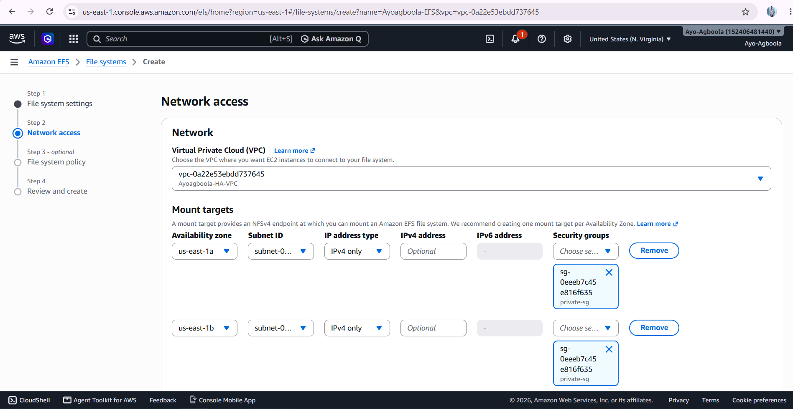

# Shared Storage. Amazon EFS

Amazon Elastic File System (EFS) was used as the shared storage layer for the web application.

The purpose of using EFS was to provide a common storage location that could be accessed by the application servers. This supports the high-availability and scalability design because multiple EC2 instances can access the same website files.

## 01. EFS Filesystem

The EFS filesystem was created to provide shared storage for the application.



## 02. Filesystem ID

The filesystem ID identifies the EFS resource created for the project. This ID was also required when configuring the EC2 instances to mount the filesystem.


## 03. Mount Targets

Mount targets were configured so that resources within the VPC could connect to the EFS filesystem.


The mount targets allow the filesystem to be accessed from the Availability Zones used by the infrastructure.

## EFS Mount Configuration

The web servers were configured to mount the shared filesystem to:

```text
/var/www/html
```

This allowed Nginx to serve the website files from the shared EFS storage.

The Jump Server also had an EFS mount configuration as part of the project setup.

## Why EFS Was Used

In a load-balanced environment, requests can be distributed between different EC2 instances.

If website files were stored separately on each server, the servers could potentially serve different versions of the application.

Using shared EFS storage provides a common location for the website files, allowing the application instances to work with the same content.

## Outcome

The EFS layer provided shared storage for the web application and supported the scalability of the EC2 environment.

It also demonstrated how storage can be separated from individual compute instances in a cloud infrastructure design.
