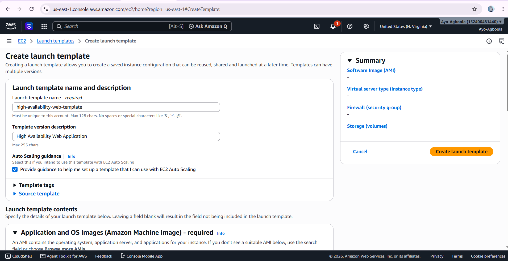
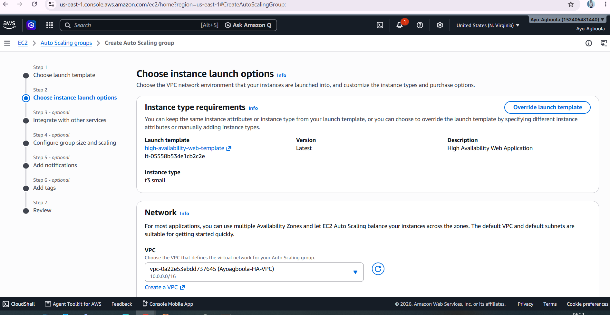
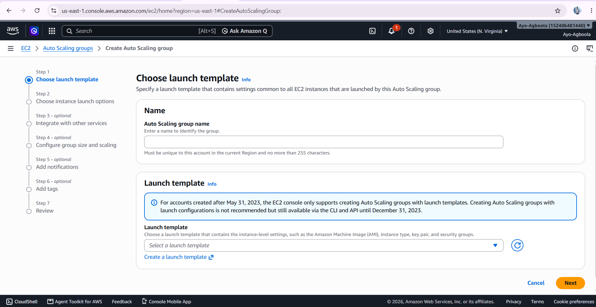

# Auto Scaling

Auto Scaling was introduced to make the web application more resilient and scalable.

Instead of relying on a fixed number of manually created servers, an Auto Scaling Group was configured to manage the application instances.

## Launch Template

The Launch Template defines how new web server instances should be created.

It provides the configuration that an instance needs when it is launched as part of the Auto Scaling Group.

This makes it possible to create consistent application servers rather than configuring every new server manually.

## Auto Scaling Group

The Auto Scaling Group manages the EC2 instances used by the web application.

It maintains the required number of instances and can replace an unhealthy instance when necessary.

The instances are distributed across the Availability Zones configured for the application environment.

## High Availability

Running the application across multiple Availability Zones reduces dependence on a single EC2 instance or Availability Zone.

If one application instance becomes unavailable, the remaining instances can continue serving requests while the Auto Scaling Group works to maintain the required capacity.

## Screenshots

The screenshots in this section document the Launch Template and Auto Scaling Group configuration.

## Outcome

The Auto Scaling layer introduced scalability and resilience into the infrastructure.

The application was no longer dependent on a single manually maintained web server. New instances could be created using the same configuration defined by the Launch Template.
