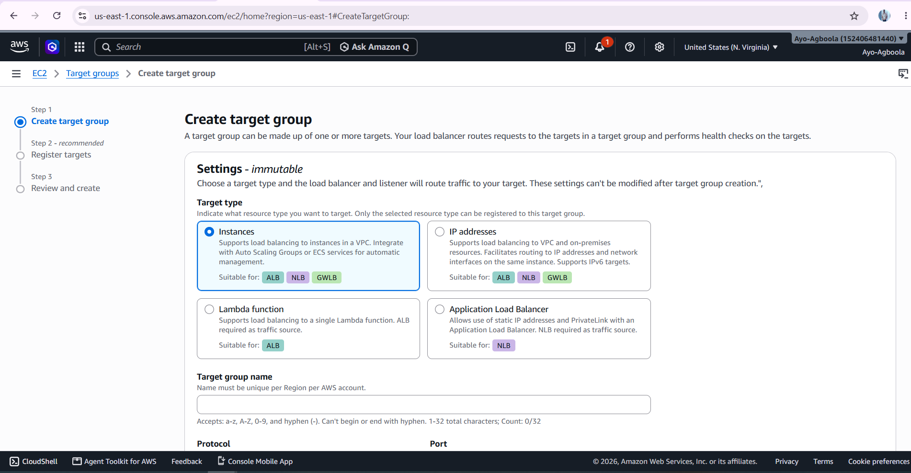
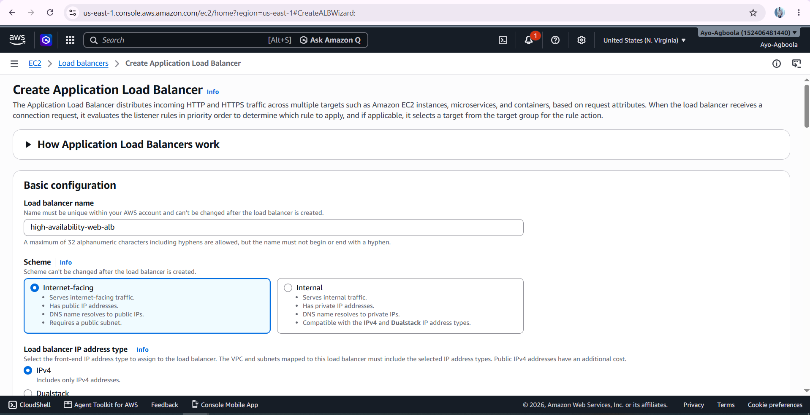
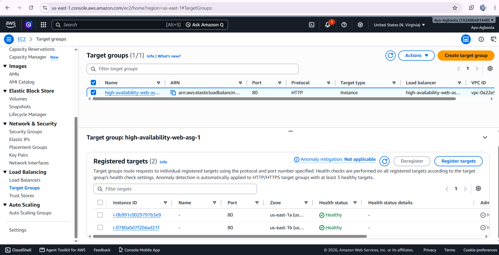
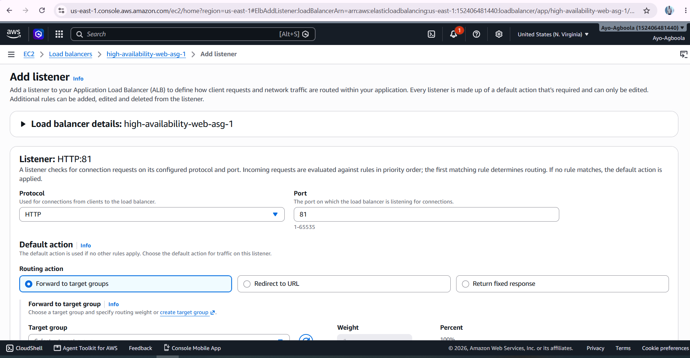

# Application Load Balancer

The Application Load Balancer (ALB) was introduced as the entry point for traffic coming into the web application.

Instead of users connecting directly to an individual EC2 instance, requests are sent to the load balancer. The load balancer then distributes those requests across the available application servers.

## Target Group

A target group was created to identify the EC2 instances that should receive traffic from the Application Load Balancer.

The target group also performs health checks to determine whether an application instance is available to receive traffic.

## Application Load Balancer

The Application Load Balancer was configured as an internet-facing load balancer.

It was deployed across multiple Availability Zones and connected to the target group containing the application servers.

## Health Checks

Health checks allow the load balancer to identify unhealthy application instances.

If an instance fails its health check, the load balancer can stop sending new requests to that instance while the Auto Scaling Group works to maintain the required capacity.

## HTTPS

An HTTPS listener was later configured on port 443 using an Amazon Certificate Manager certificate for the project domain.

HTTP traffic was configured to redirect to HTTPS so that users access the website through an encrypted connection.

## Screenshots

The screenshots in this section document the target group, Application Load Balancer and listener configuration.

## Outcome

The load balancing layer provides a single entry point to the application while distributing traffic across multiple EC2 instances.

This reduces dependence on an individual server and supports the high-availability design of the project.

