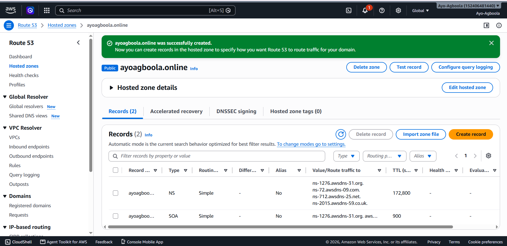
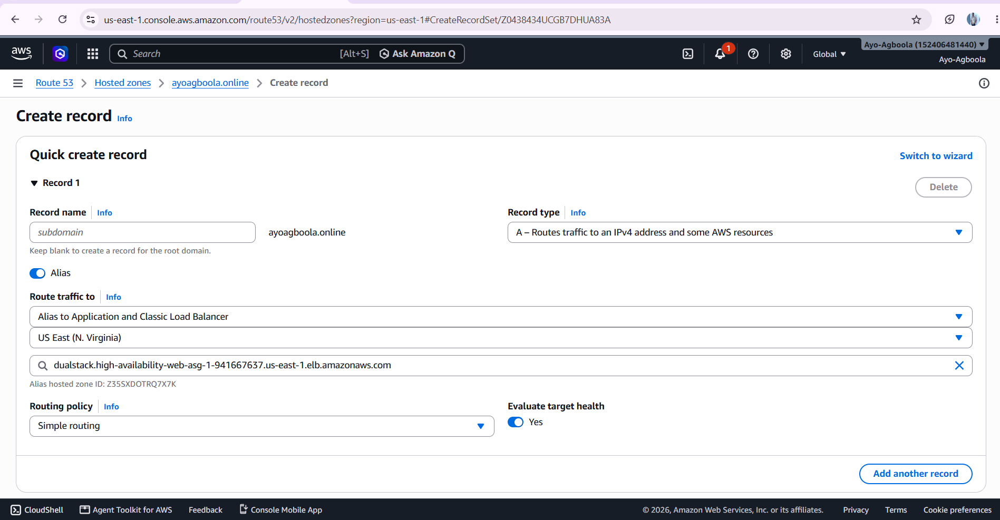
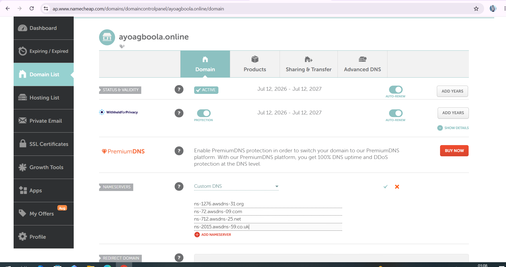

# Domain and DNS. Amazon Route 53

Amazon Route 53 was used to connect the project's custom domain to the Application Load Balancer.

The purpose of this stage was to allow users to access the application using a readable domain name rather than the DNS name automatically generated for the load balancer.

## Hosted Zone

A public hosted zone was created for:

```text
ayoagboola.online
```

The hosted zone provides the DNS management layer for the domain.

## DNS Record

An Alias A record was created for the root domain.

The record points:

```text
ayoagboola.online
```

to the Application Load Balancer.

Because the record uses an AWS Alias, the domain can route traffic to the load balancer without requiring the public IP address of an individual EC2 instance.

## DNS Configuration

The domain registrar was also configured with the Route 53 name servers assigned to the hosted zone.

This allows Route 53 to act as the authoritative DNS service for the domain.

## Screenshots

The screenshots in this section document the Route 53 hosted zone, DNS record and name server configuration.

## Outcome

The custom domain was successfully connected to the Application Load Balancer.

Users can therefore access the application through the project domain rather than connecting directly to an individual server.

