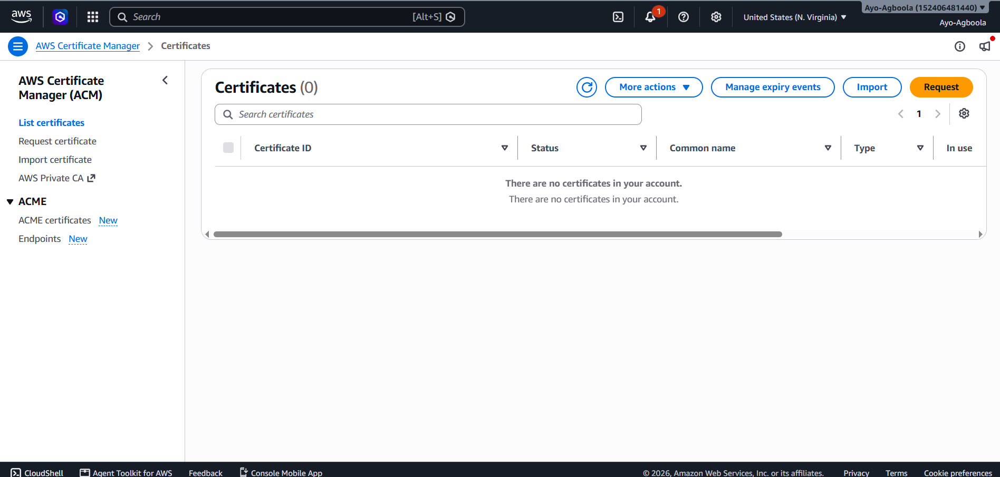
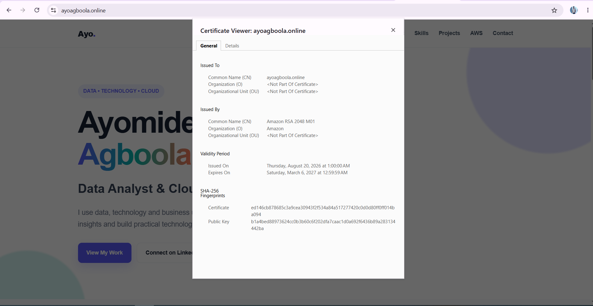
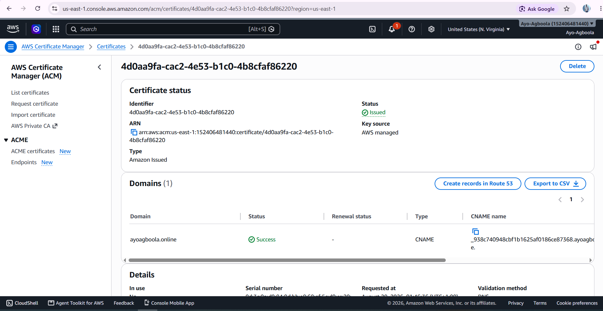

# HTTPS and AWS Certificate Manager

HTTPS was configured to secure communication between users and the Application Load Balancer.

AWS Certificate Manager (ACM) was used to request and validate the SSL/TLS certificate for the project domain.

## Certificate Request

A certificate was requested for:

```text id="qz6x2a"
ayoagboola.online
```

DNS validation was selected as the validation method.

## DNS Validation

The certificate required a DNS validation record to confirm ownership of the domain.

The validation record was created in the Route 53 hosted zone.

The certificate initially remained in a pending validation state until the DNS configuration was correctly recognised.

## Certificate Issued

After the DNS validation was completed, the ACM certificate changed to:

**Issued**

The certificate could then be attached to the Application Load Balancer HTTPS listener.

## HTTPS Listener

An HTTPS listener was configured on:

```text id="p9x4fk"
Port: 443
```

The ACM certificate was selected as the default SSL/TLS server certificate.

Traffic received through HTTPS was forwarded to the application's target group.

## HTTP to HTTPS Redirect

The Application Load Balancer was also configured to redirect HTTP requests to HTTPS.

This means that users who enter the HTTP version of the website are automatically redirected to the secure HTTPS version.

## Challenge Encountered

During the domain configuration stage, the website initially returned a DNS:

```text id="8jv6tz"
DNS_PROBE_FINISHED_NXDOMAIN
```

The issue was related to the domain's DNS configuration.

The Route 53 name servers were subsequently configured correctly at the domain registrar and the DNS records were created in the Route 53 hosted zone.

After propagation, the domain resolved correctly and the ACM certificate could be validated.

## Outcome

The website was successfully secured with HTTPS.

The final traffic flow became:

**User → HTTPS → Application Load Balancer → Target Group → EC2 Web Servers**

This provides encrypted communication while maintaining the load-balanced application architecture.

