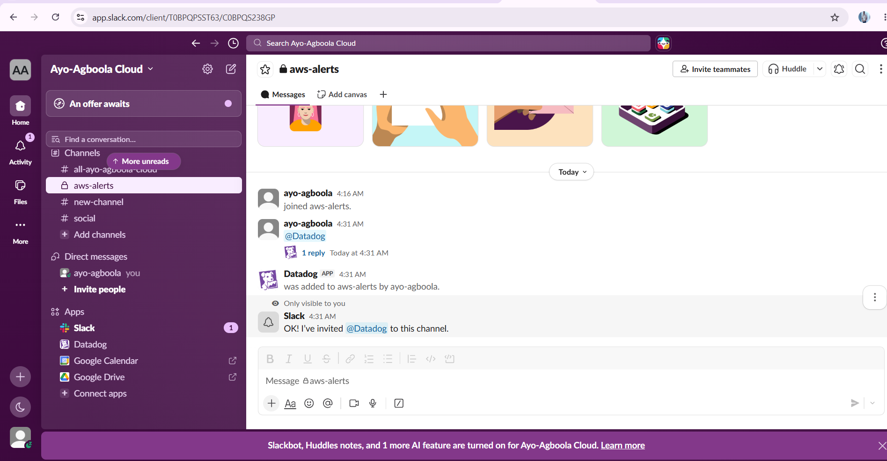
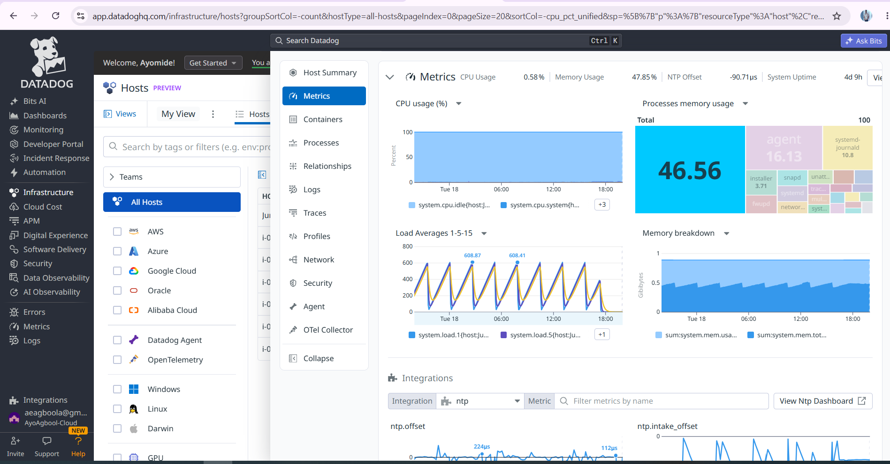
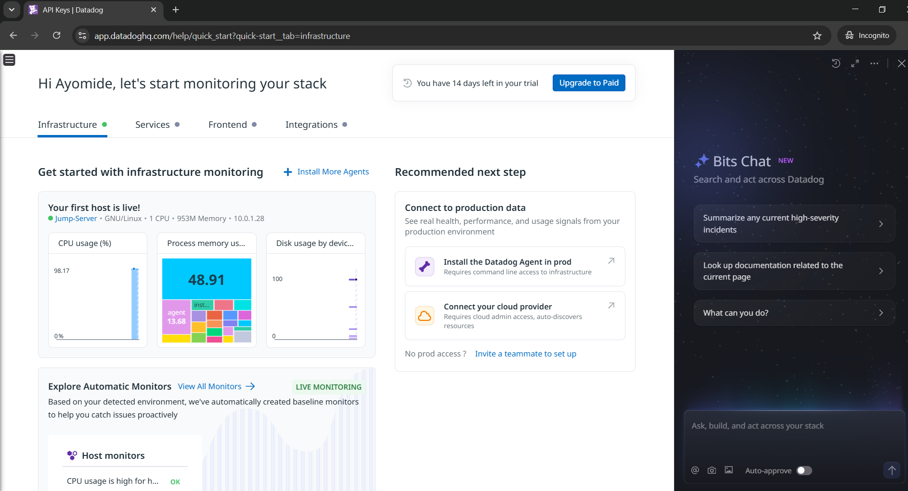
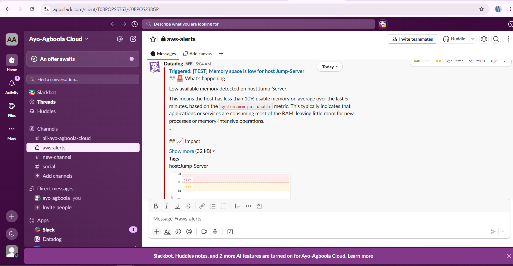

# Monitoring and Alerts. Datadog and Slack

Datadog was integrated into the infrastructure to monitor the health and performance of the application servers.

The purpose was not simply to monitor whether the website was running. The infrastructure was generating operational data such as CPU utilisation, and that data could be monitored to identify conditions that required attention.

## Datadog Agent

The Datadog Agent was installed on the EC2 instances.

The Agent collects system-level information from the servers and sends the monitoring data to Datadog.

This provides visibility into the behaviour of the infrastructure after deployment.

## Infrastructure Monitoring

Datadog was used to monitor infrastructure metrics, including CPU utilisation across the application hosts.

These metrics provide a continuous view of how the servers are performing.

## Alert Configuration

A Datadog monitor was configured to trigger an alert when the monitored CPU metric exceeded the defined threshold.

The alert was tested during the project to confirm that the monitoring workflow was functioning.

## Slack Integration

Datadog was connected to Slack so that monitoring alerts could be delivered to the designated Slack channel.

This means that a condition detected from infrastructure data could move through the following process:

**Infrastructure → Metric → Monitor → Alert → Slack Notification**

## Testing

A test notification was triggered during the configuration process.

The Slack notification confirmed that the alerting workflow was able to deliver a Datadog alert to the Slack channel.

## Challenge Encountered

During the monitoring configuration, the Datadog monitor initially displayed the aggregation as **average by host** and the host filtering did not behave as expected.

The monitor continued to display an unexpected host tag configuration even though the intended hosts were already available in the selection.

Rather than allowing the monitoring configuration to delay the wider infrastructure project, the monitoring setup was treated as a separate troubleshooting stage.

## Analytics Connection

This monitoring layer is particularly relevant to the data analytics aspect of the project.

The infrastructure continuously generates operational data. Monitoring makes that data visible, while alerting turns a change in the data into an action.

The same principle applies to analytics in a business environment:

**Collect → Analyse → Interpret → Act**

The difference is that, in this project, the data is coming from cloud infrastructure rather than from a business transaction system.

## Outcome

Datadog provided infrastructure visibility and Slack provided an operational notification channel.

Together, they demonstrated how infrastructure data can be collected, monitored and converted into actionable alerts.

