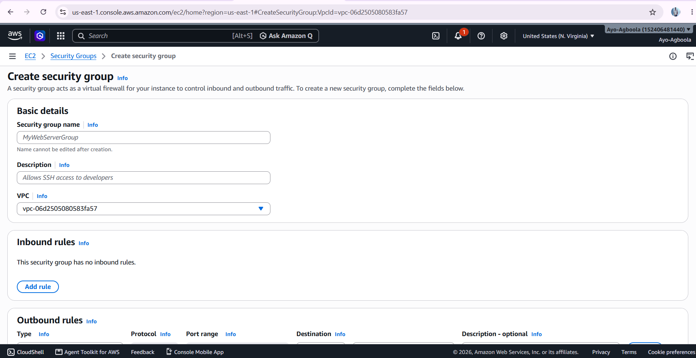

# VPC and Networking

This section contains screenshots from the network foundation of the High Availability AWS Infrastructure Project.

The infrastructure was designed across multiple Availability Zones, with separate public and private subnets. The network configuration provides the foundation for distributing application workloads while controlling how resources communicate with the internet and with each other.

## 01. VPC

The VPC provides the main network boundary for the AWS infrastructure.

## 02. Subnets

The VPC was divided into public and private subnets across Availability Zones. This provides the network structure required for the high-availability design.

## 03. Route Tables

Route tables were configured to determine how traffic moves between the subnets, the Internet Gateway and the NAT Gateway.

## 04. Internet Gateway

The Internet Gateway provides internet connectivity for resources that require direct access through the public subnets.

## 05. NAT Gateway

The NAT Gateway allows resources in the private subnets to initiate outbound internet connections without making those resources directly accessible from the internet.

## 06. Security Groups

Security Groups were configured to control inbound and outbound traffic to the AWS resources used in the project.

## Networking Outcome

These configurations established the network foundation for the remaining infrastructure.

The completed networking layer provided:

* A dedicated VPC.
* Public and private subnets.
* Multi-AZ network design.
* Controlled internet access.
* Private subnet outbound connectivity through NAT.
* Traffic routing through route tables.
* Security controls through Security Groups.

